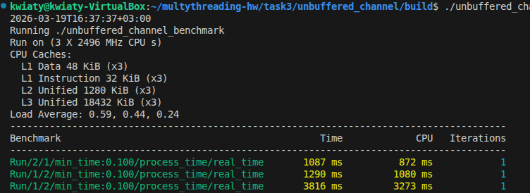
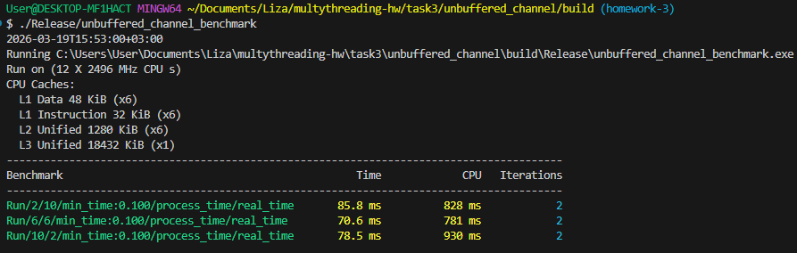

Решение состоит из файлов:

* **_unbuffered_channel.h_** - реализация канала
* **_test.cpp_** - заданные тесты
* **_benchmark.cpp_** - заданные бенчмарки
* **_CMakeLists.txt_** - заданный файл для сборки конфигурации

Выводы фактически полученные на системе, на которой разрабатывалось решение получались иногда пограничными:
```
2026-03-19T16:37:37+03:00
Running ./unbuffered_channel_benchmark
Run on (3 X 2496 MHz CPU s)
CPU Caches:
  L1 Data 48 KiB (x3)
  L1 Instruction 32 KiB (x3)
  L2 Unified 1280 KiB (x3)
  L3 Unified 18432 KiB (x3)
Load Average: 0.59, 0.44, 0.24
----------------------------------------------------------------------------------------
Benchmark                                              Time             CPU   Iterations
----------------------------------------------------------------------------------------
Run/2/1/min_time:0.100/process_time/real_time       1087 ms          872 ms            1
Run/1/2/min_time:0.100/process_time/real_time       1290 ms         1080 ms            1
Run/1/2/min_time:0.100/process_time/real_time       3816 ms         3273 ms            1
```



Поскольку виртуальная среда действительно скромная было запуск на ещё одной среде:

```
$ ./Release/unbuffered_channel_benchmark
2026-03-19T15:53:00+03:00
Running C:\Users\User\Documents\Liza\multythreading-hw\task3\unbuffered_channel\build\Release\unbuffered_channel_benchmark.exe
Run on (12 X 2496 MHz CPU s)
CPU Caches:
  L1 Data 48 KiB (x6)
  L1 Instruction 32 KiB (x6)
  L2 Unified 1280 KiB (x6)
  L3 Unified 18432 KiB (x1)
-----------------------------------------------------------------------------------------
Benchmark                                               Time             CPU   Iterations
-----------------------------------------------------------------------------------------
Run/2/10/min_time:0.100/process_time/real_time       85.8 ms          828 ms            2
Run/6/6/min_time:0.100/process_time/real_time        70.6 ms          781 ms            2
Run/10/2/min_time:0.100/process_time/real_time       78.5 ms          930 ms            2
```



