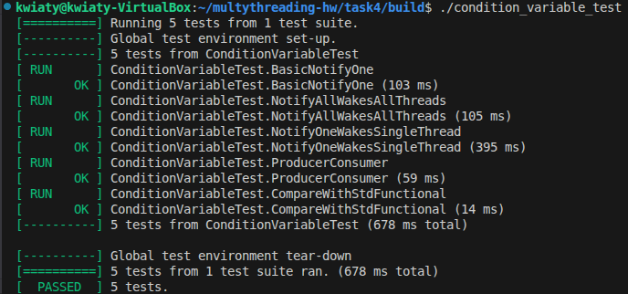

Решение состоит из файлов:

* **condition_variable.h** - реализация условной переменной
* test_condition_variable.cpp - тесты
* CMakeLists.txt - файл для сборки конфигурации

Результаты тестирования реализации:
```
[==========] Running 5 tests from 1 test suite.
[----------] Global test environment set-up.
[----------] 5 tests from ConditionVariableTest
[ RUN      ] ConditionVariableTest.BasicNotifyOne
[       OK ] ConditionVariableTest.BasicNotifyOne (103 ms)
[ RUN      ] ConditionVariableTest.NotifyAllWakesAllThreads
[       OK ] ConditionVariableTest.NotifyAllWakesAllThreads (105 ms)
[ RUN      ] ConditionVariableTest.NotifyOneWakesSingleThread
[       OK ] ConditionVariableTest.NotifyOneWakesSingleThread (395 ms)
[ RUN      ] ConditionVariableTest.ProducerConsumer
[       OK ] ConditionVariableTest.ProducerConsumer (59 ms)
[ RUN      ] ConditionVariableTest.CompareWithStdFunctional
[       OK ] ConditionVariableTest.CompareWithStdFunctional (14 ms)
[----------] 5 tests from ConditionVariableTest (678 ms total)

[----------] Global test environment tear-down
[==========] 5 tests from 1 test suite ran. (678 ms total)
[  PASSED  ] 5 tests.
```



