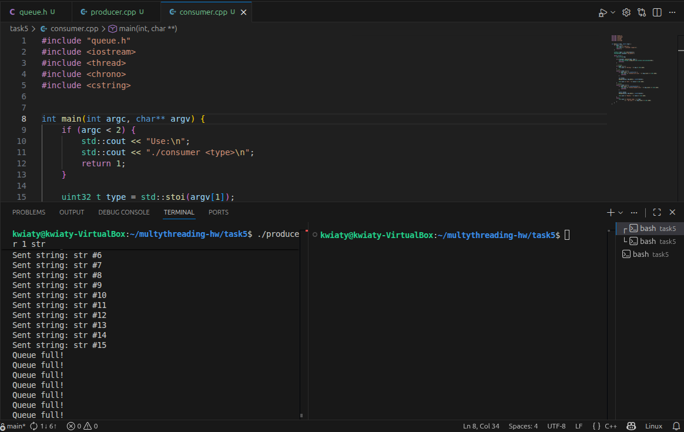
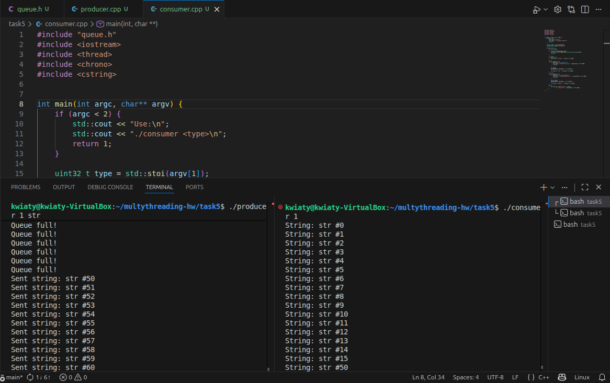
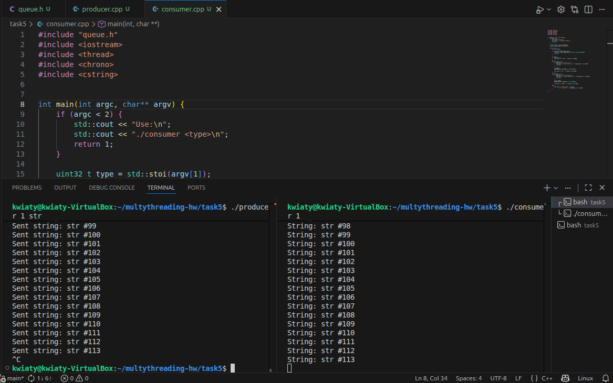
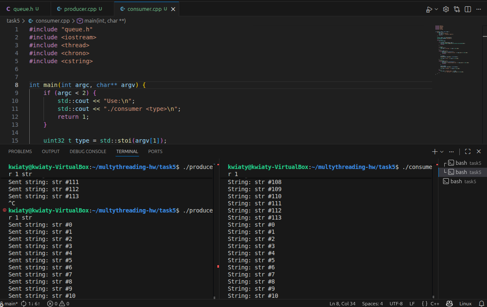
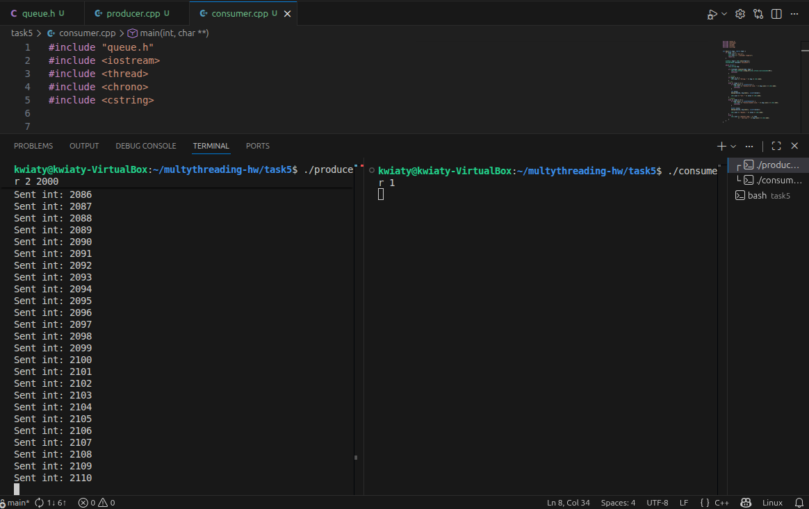
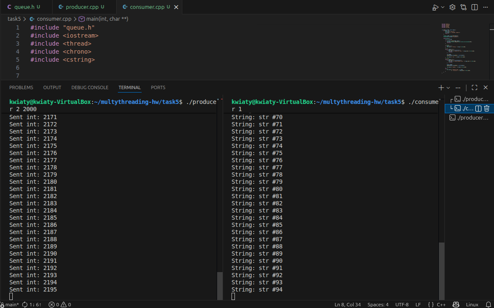
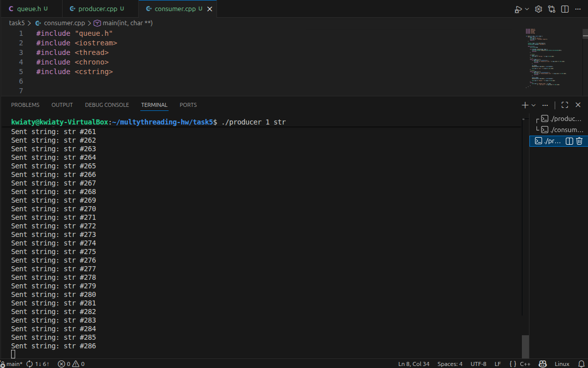

Решение состоит из файлов:

* **queue.h** - реализациb сущностей
* consumer.cpp - файл для создания читающего потока 
* producer.cpp - файл для создания пишущего потока

Сборка следующими командами:

```bash
g++ -std=c++17 producer.cpp -o producer -pthread
g++ -std=c++17 consumer.cpp -o consumer -pthread
```

Запуск потоков:
```bash
./producer 1 str
./produser 2 2000
./consumer 1
```

Файлы для создания потоков написаны универсально - так, что можно задать тип сообщений, который будет записываться/читаться:
* 1 - string
* 2 - int
* 3 - double

Записывающий поток итеративно меняет введенные вторым аргументом данные, чтобы видеть разницу между пакетами.

Созданные для тестирования потоки не чистят память и могут работать пока их не остановят. Для очистки и освобождения памяти использовать:
```
rm /dev/shm/my_queue
```

## Тест 1: Producer пишет, Consumer не читает -> буфер заполняется


## Тест 2: буфер полный, Consumer начинает читать -> Producer начинает писать
Заполняем буфер, затем запускаем consumer. Как только тот начинает читать, новые сообщения записываются ("str 50" и далее). Номера идут с разрывом, потому что так прописаны тесты: producer пытается сделать 1000 записей, однако если буфер переполнен, то producer ничего не пишет, но счётчик всё равно переключается каждую попытку.



## Тест 3: Producer перестает писать, Consumer читает всё оставшееся и зависает в ожидании
Во втором терминале consumer впадает в ожидание:


Пока не появляются новые данные:


## Тест 4: 2 Producer'а пишет разные данные, Consumer фильтрует
Запускаем поток, который пишет intы, и поток, который читает string: intы не заполняют буфер, так как поток их затирает, но не обрабатывает 


Если запустить два producerа (один с int, другой с string), то consumer читает только свой тип: 


